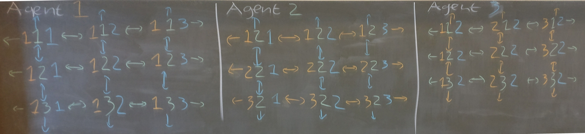

**Contents:**
- [Introduction](#introduction)
- [Methods](#methods)
- [Analysis](#analysis)
- [Discussion](#discussion)
- [References](#references)

**Preface:**

The code and build instructions can be found at the [repository](https://github.com/suraoxa/MAS "The repository"). This website is created with Markdown and Github Pages. Unfortunately, it is not possible to use the notation that is common in logic texts. So, we had to make some changes which are summarized below.

| Symbol | Meaning  | | Symbol | Meaning  |
|--------|----------|-|--------|----------|
| &      | and      | | ~      | absurd   |
| &#124; | or       | | p, q   | sentence |
| !      | not      | | P, Q   | atom     |

# Introduction

Perudo is a hidden information bidding game. Players try to guess the number of dice with a certain number of eyes on the entire table, while only knowing their own throw. This is done by bidding. After a bid, the next player can either choose to believe the bid and make a new (higher) bid, or that player can choose not to believe the bid and 'call' the previous player's bid. The complete rules can be found on the [official website](http://www.perudo.com/perudo-rules.html "Official Perudo website"). Perudo is an interesting game to analyze since, in order to perform well, players can not just look at their own dice, but have to reason about dice they cannot see. As each player does the same, information about other players' dice could be inferred from their bids.

Perudo is an interesting yet challenging game from an epistemic logic point of view: each players only knows about their own dice, so players need to reason about other players' bids in order to determine whether to bid or call. As a player you also need to account for the fact that other players can take into account your bids in their own bid. By reasoning about what we know (our own dice), what we believe to be true (other players' dice based on how they have bid so far) and what we do not know (any dice we do not have a believe or knowledge about), we can make an estimation about when to bid or call. Opposed to a purely probabilistic implementation, epistemic logic provides a lot of very useful tools such as Knowledge, Beliefs and Announcements which can be used to describe and reason about the game state.

One of the issues in using epistemic logic for modeling Perudo is the state size: starting with 3 players and 5 dice per player, the total number of possible worlds would be `6 ^ 15 = 470.184.984.576`. This state size makes constructing a Kripke model, which is one of the standard methods when using logics to model strategic games[\[1\]](#ref1), practically impossible. For more in-depth information about Kripke models in this application, see the [Kripke model](#kripke-model) section. Nevertheless, our goal is to build an agent using epistemic logic combined with statistical knowledge that can play Perudo.

[Back to the top](#top)

# Methods

Due to time constraints only a simplified version of Perudo could be modeled with a fixed number of agents. We removed jokers (or 'Aces') and the special rules which apply when someone only has one die left. The version that we modeled uses three agents with five dice each, and can be summarized as follows:
- All agents roll their dice.
- The first agent makes a bid (`d` dice with `e` eyes).
- The next agent can either call the bid or make a new bid. A new bid needs to have `d + 1` dice when it is about `e` or less eyes. It may have `d` dice when it is about more than `e` eyes.
- Agents repeat making bids until an agent calls. The call is correct when the last made bid has more dice with the specified number of eyes than there actually are rolled. In that case the agent that made the bid loses a die and starts the next round. If the bid is incorrect the agent that called the bid loses a die and starts the next round.
- Rounds are repeated until only one agent has any dice left. That agent is the winner of the game.

### How are agents modeled?

A turn of an agent is divided into three parts. In the first part the agent processes the bids made by the other agent since his last turn. This part tries to determine what dice the other agents have in order to better estimate the chances of potential bids. The second part generates the minimum required bids for each number of eyes and computes an evaluation. Finally, the third part uses the evaluation to pick the best valid bid, and decides between bidding or calling the previous bid.

#### Notation

Let `B = <d, e, id>` be a bid, where `d` is the number of dice, `e` is the number of eyes, and `id` is an identifier of the agent that made the bid.

Let `d = observedDice(e)` be a function that returns the number of dice `d` with eyes `e` that have been observed in previous turns of this stage. An alternative `d = observedDice(e , id)` returns the number of dice `d` with eyes `e` that have been observed using only bids made by agent `id`.

Let `d = numDiceOf(id)` be a function that returns the total number of dice `d` that agent `id` has left.

Let `d = diceOf(e, id)` be a function that returns the number of dice `d` that agent `id` has thrown with `e` eyes.

Let `d = unknownDice(id)` be the number of dice of which agent `id` does not believe anything yet. This can be computed as the total number of dice that the other agents have minus the number of observed dice for those agents for all eyes.

#### Processing bids
At the start of each turn agents process the bids that were made since their last turn. This includes the bid that they made themselves in their turn. The goal of this stage is to estimate how many dice with the specified number of eyes the agent that made the bid has. By also processing their own bids agents keep track of what other agents think that they have.

The maximum number of dice `d` to bid with `e` eyes in bid `B = <d, e, id>` can be computed by adding agents `id`'s own dice with `e` eyes, the expected number of dice with `e` eyes among the dice that agent `id` does not have a belief about, and the number of dice that have been observed to have `e` eyes for the other agents:
- `d = diceOf(e, id) + unknownDice(id) / 6 + observedDice(e) - observedDice(e, id)`

In this stage other agents estimate `diceOf(e, id)` based on the information that they have, under the assumption that the `d` of the bid is computed with the above formula. The formula can be reordered for that purpose:
- `diceOf(e, id) = d - unknownDice(id) / 6 - observedDice(e) + observedDice(e, id)`

For coding simplicity the equation is written to be used as an incremental update:
- `diceOf(e, id) - observedDice(e, id) = d - unknownDice(id) / 6 - observedDice(e)`

The left side of the equation can be interpreted as the additional number of dice that an agent believes that agent `id` should have in order to bid `B`. Since agents cannot simply look up the state of other agents the equation has to be rewritten to use only resources that every agent has. Specifically, `unknownDice(id)` is not directly known to other agents.

Suppose agent `1` is evaluating `unknownDice(id)` from its perspective in the context of a bid `B = <d, e, id>`. Then if agent `1` made the bid, simply use `unknownDice(1)`. If the bid is not made by agent `1` compute it using the information about the agents that did not made the bid. First add the number of dice of the agents that did not make the bid, then subtract the number of dice that are observed from those agent. (In this example let `id` be `3`)
- `unknownDice(id) == numDiceOf(1) - SUM(0<i<=6,observedDice(i, 1)) + numDiceOf(2) - SUM(0<i<=6,observedDice(i, 2))`

So the final formula for evaluating the value `v` of a bid `B` in the perspective of agent `1` is:
- `v = d - (numDiceOf(1) - SUM(0<i<=6,observedDice(i, 1)) + numDiceOf(2) - SUM(0<i<=6,observedDice(i, 2))) / 6 - observedDice(e)` or
- `v = d - unknownDice(1) / 6 - observedDice(e)`

The computed value `v` is rounded and given a minimum of `0` and a maximum of `d`. The result is added to `observedDice(e, id)` by each agent that evaluates bid `B`.

#### Generating potential bids

The second stage of an agent's turn consists of generating potential bids. As mentioned before, agents have to bid at least as many or more dice as the previous bid depending on the number of eyes. So agents compute the minimum number of dice that have to be bid for all number of eyes (from 1 up to and including 6).

Suppose `B = <d, e, id>` is the previous bid. Then all bids with less or `e` eyes have to bid at least `d + 1` dice. All bids with more than `e` eyes have to bid at least `d` dice.

#### Deciding on an action

All bids that were generated in the previous stage are evaluated in this stage in order to compute the expected number of dice that there are in the game with `e` eyes more than the bid requires to be correct. In addition the bid made by the previous agent is evaluated in order to decide whether it should be called.

Bids `B = <d, e, id>` are evaluated based on the difference of `d` to the maximum number of dice with `e` eyes that the agent expects to be in the game. This formula is similar to the one mentioned in the section about [processing bids](#processing-bids). The formula is negative when the agent believes that there are less dice with `e` eyes in the game than that the bid says (`d`).
- `value = diceOf(e, id) + unknownDice(id) / 6 + observedDice(e) - observedDice(e, id) - d`

A random bid is picked from the potential bids with the highest evaluation. Then the evaluation of that bid is compared to the evaluation of the last made bid. If the last made bid has an evaluation more negative than that the best potential bid is positive, the agent calls. Since, in that case, the agent believes that the last made bid is more likely to be incorrect than his best option is correct. Otherwise the agent makes the best bid.

[Back to the top](#top)

# Analysis

Any language used to describe our Perudo model should be able to express beliefs, knowledge, and announcements in a dynamic distributed system. We therefore need to create a system of special axioms[\[2\]](#ref2). For that purpose we have combined the languages `LB`, `LKEC`, and `LKC[]`. The axioms of the new language are:

- `R1` : if `p` and `p -> q` then `q`
- `R2K`: if `p` then `Ki p (for i=1,..,m)`
- `R2B`: if `p` then `Bi p (for i=1,..,m)`
- `R3K`: if `p` then `CK p`
- `R3K`: if `p` then `CB p`
- `A1` : All (instances of) propositional tautologies.
- `A2K`: `(Ki p & Ki(p -> q)) -> Ki q (for i=1,..,m)`
- `A2B`: `(Bi p & Bi(p -> q)) -> Bi q (for i=1,..,m)`
- `A3` : `Ki p -> p (for i=1,..,m)`
- `D` : `!Bi ~ (for i=1,..,m)`
- `A4K`: `Ki p -> Ki Ki p (for i=1,..,m)`
- `A4B`: `Bi p -> Bi Bi p for i=1,..,m)`
- `A5K`: `!Ki p -> Ki !Ki p (for i=1,..,m)`
- `A5B`: `!Bi p -> Bi !Bi p (for i=1,..,m)`
- `A6K`: `EK p <--> K1 p & ... & Km p`
- `A6B`: `EB p <--> B1 p & ... & Bm p`
- `A7K` : `CK p -> p`
- `A7B` : `!CB ~`
- `A8K`: `CK p -> EK CK p`
- `A8B`: `CB p -> EB CB p`
- `A9K`: `(CK p & CK (p -> q)) -> CK q`
- `B9B`: `(CB p & CB (p -> q)) -> CA q`
- `A10K`: `CK (p -> EK q) -> (p -> CK q)`
- `A10B`: `CB (p -> EB q) -> (p -> CB q)`
- `P1` : `[p]P <--> (p -> P)`
- `P2` : `[p]!q <--> (p -> ![p]q)`
- `P3` : `[p](q & x) <--> ([p]q & [p]x)`
- `P4K` : `[p]Ki q <--> (p -> Ki [p]q)`
- `P4B` : `[p]Bi q <--> (p -> Bi [p]q)`
- `P5` : `[p][q]x <--> [p & [p]q]x`

#### Kripke model

Our simulation does not use a Kripke model of the problem because the state space is too large. Every agent has to take into account `6^10` states, with a total of `6^15` possible worlds in a turn with 15 dice. The complete model also has to take into account states with less than 15 dice. Using such a large model simply takes too much time. Instead we used probabilities, as described in the [methods](#methods) section. In this way we have included probabilities as a state of possible worlds, as advocated by Kooi(2003)[\[3\]](#ref3).This remainder of this section describes how our version of Perudo can be made into a Kripke model and gives an example of a small state.

A Kripke model is defined as a tuple of `M = <S, pi, RK, RB>`. Where `S` is the set of all possible worlds, i.e. any combination that three groups of at most 5 dice can create. It can be best thought of as a set of tuples of three arrays, where each array describes how many dice an agent has with a certain number of eyes (`S = {<[a1:1,..,f1:6], [a2:1,..,f2:6], [a3:1,..,f3:6]>}`). `pi` is the truth assignment of all propositional atoms in every state (`pi: S -> {t, f}`). `RK` is the set of accessibility relations between all states used for the knowledge operator. `RB` is the set of accessibility relations between all states used for the belief operator.

The following atoms are used:
- `dTx (for x=0,..,15)` There are `x` dice in the game.
- `dAm,x (for x=0,..,15; m=1,..,3)` Agent `m` has `x` dice.
- `eTx,y (for x=0,..,15; y=1,..,6)` There are at least `x` dice with `y` eyes in the game.
- `eAm,x,y (for x=0,..,15; y=1,..,6; m=1,..3)` Agent `m` has at least `x` dice with `y` eyes in its hand.

The truth assignment is defined as follows:
- `pi(s)(dTx) = t` iff there are `x` dice in `s`.
- `pi(s)(dAm,x) = t` iff there are `x` dice in agent `m`'s hand in `s`.
- `pi(s)(eTx,y) = t` iff there are `x` or more dice with `y` eyes in `s`.
- `pi(s)(eAm,x,y) = t` iff there are `x` or more dice with `y` eyes in agent `m`'s hand in `s`.

It is important to note that some atoms describe a state with 'at least' a number of dice in some situation. So in most states multiple variants of the same atom can be true. For instance, if agent 1 has 3 dice with 2 eyes then `eA1,1,2`, `eA1,2,2` and `eA1,3,2` are all true.

#### Predefined knowledge

It is common knowledge that there are 15 dice at the start of the game. This restricts the `RK` and `RB` of all agents to only use states with 15 dice.
- `CK dT15`

It is also common knowledge how many dice every agent has. At the start of a game each agent has 5 dice. In other rounds this expression also restricts `RK` and `RB`.
- `CK dAm,5 (for m=1,..,3)`

Agents also know what they have thrown, there is no uncertainty about their own state.
- `Km eAm,x,y (for m=1,..,3; y=1,..,6; x=0,..,n)`

where `n` is the number of dice that agent `m` has with `y` eyes.

#### Example of a small state

The state space of Perudo is very large. Only for very simple situations is it possible to create the entire Kripke model. In this section a round of Perudo with three agents that each have one die with three sides is shown. The state space of this situation forms a 3D cube.

The states that an agent holds for possible form a plane. The image below shows initial states of all agents. All the states in the plane are inter-accessible for their respective agent. The other agents can only access the rows or columns respectively, as in a distributed system. The states indicate for each agent how many eyes it has rolled. This is a simpler representation than the representation used for the complete problem because each agent only has one die. In this section agent 1 is written in red, agent 2 is in green and agent 3 is in blue. The real state is as follows: agent 1 has rolled a `1`, agent 2 has a `2` and agent 3 also has a `2`.

In this model it is common knowledge that there are three dice in total, and that each agent has one die.
- `CK dT3`
- `CK dA1,1`, `CK dA2,1`, `CK dA3,1`

Each agent also knows what it has rolled.
- `K1 eA1,0,1`, `K1 eA1,1,1`, `K1 eA1,0,2`, `K1 eA1,0,3`
- `K2 eA2,0,1`, `K2 eA2,0,2`, `K2 eA2,1,2`, `K2 eA2,0,3`
- `K3 eA3,0,1`, `K3 eA3,0,2`, `K3 eA3,1,2`, `K3 eA3,0,3`

**Turn 1**

Now it is agent 1's turn to make a bid. It starts by generating possible bids, i.e. one die for each number of eyes. These three bids are evaluated using the formula given in the [methods](#methods) section:
- `value = diceOf(y, 1) + unknownDice(1) / 3 + observedDice(y) - observedDice(y, 1) - 1`

`diceOf(y, 1)` translates to the maximum `x` for which `K1 eA1,x,y` is true. In this case `x=1` for `1` eye, `x=0` for `2` eyes, and `x=0` for `3` eyes.

`unknownDice(1)` translates to the `x` for which `K1 dTx` is true, minus the `x` for which `K1 dA1,x` is true, minus the sum of the maximum `x` for which `B1 eAm,x,y` is true over `m=2,3` and `y=1,..,3` (if `B1 eAm,x,y` does not hold for any combination of `x` and `y` then use 0). Resulting in a value of 2, since there are two dice that agent 1 does not believe anything about.

`observedDice(y) - observedDice(y, 1)` translates to the sum of the maximum `x` for which `B1 eAm,x,y` is true over `m=2,3`. Resulting in a value of 0, because agent 1 does not have a belief about the dice of the other agents yet.

So agent 1 bids 1 die with `1` eye because it has the highest evaluation. Making the bid results in a common belief about the bid (under the assumption that all agents use our method) after the other agents have processed the bid.
- `[B1 eT1,0] CB B1 eT1,1`

Both agents 2 and 3 process the bid in order to estimate how many dice with 1 eye agent 1 should have in order to bid 1 die with 1 eye. Again the formula of the [methods](#methods) section can be used:
- `diceOf(1, 1) - observedDice(1, 1) = 1 - unknownDice(1) / 3 - observedDice(1)`

`observedDice(1)` translates to the sum of the maximum `x` for which `B2 eAm,x,1` is true over `m=1,..,3`. This results in `0` because no agent believes anything about the other agents' dice yet.

`unknownDice(1)` is still `2`. So the formula results in a value of `1/3`. This value is rounded down to `0`, so agents 2 and 3 belief that agent 1 does not need to have a die with `1` eye in order to bid what it did. So the states do not change after the bid is made.

**Turn 2**

Now it is agent 2's turn to make a bid or call the previous bid. Agent 2 has to bid at least `2` dice for `1` eye or `1` die for `2` or `3` eyes. Since agent 2 has a `2` himself the bid for `1` die with `2` eyes has the highest evaluation.
- `[B2 eT1,2] CB B2 eT1,2`

The other agents process the bid, but do not update their beliefs for the same reason as in the previous turn. The states have not changed.

**Turn 3**

Now it is agent 3's turn. It has to bid at least `2` dice for `1` or `2` eyes, or `1` die with `3` eyes. The bids of `2` dice with `2` eyes and `1` die with `3` eyes evaluate the same. For this example the former will be used. In order to make this bid agent 3 has to change its beliefs. All relations to states with less than `2` dice with `2` eyes are removed from `RB` for agent 3.

The other agents process this bid. Because they both belief that agent 3 has `2` unknown dice (Agent 1's die and Agent 2's die) they expect that Agent 3 needs to have at least one more die with `2` eyes in order to make the bid. They update their beliefs accordingly, by removing the relations to all states in which agent 3 does not have at least a die with `2` eyes from their `RB`.

So now the following holds:
- `[B3 eT2,2] CB B3 eT2,2`

**Turn 4**

Now it is agent 1's turn. The bid of agent 3 evaluates to `-1` because agent 1 does not have a die with `2` eyes, agent 1 believes that agent 3 has `1` die with `2` eyes, and no other dice are expected to have `2` eyes. The possible bids that agent 1 is allowed to make all evaluate to `-2`. So agent 1 calls the previous bid because it is more negative than its potential bids are positive.

The call is incorrect because there are exactly `2` dice with `2` eyes. As a result agent 1 loses its last remaining die. Only agents 2 and 3 will play in the next round.

[Back to the top](#top)

# Discussion

We can conclude that agents using epistemic logic in conjunction with probabilistic analysis of the game state can play the game Perudo. However, a purely epistemic agent still seems implausible due to the game's state space. Below we note several issues and possible future improvements for implementing an agent using epistemic logic to play Perudo. 

## Future Work and Improvements

The game could be extended to include jokers (or 'Aces') and the rule which only applies when a player has only one die left. Jokers greatly increase the bidding process complexity and add another layer of analysis to bids, since there are more combinations of dice which can cause a bid to be true. Other possible improvements include making use of fuzzy logic. Since we work with probabilities, using rounding for evaluations is suboptimal. Fuzzy logic would allow evaluations to be more precise, allowing for a greater degree of certainty about bids.

In its current implementation, agents implicitly use the fact that they reason the same way: agents reason about other agents' bid as if they would have made the bid themselves using only information of unknown dice and beliefs based on all agents' bids. They use information gained by this to evaluate bids. However, if different agents reason in different ways (for example because one agent is bluffing and another agent is not), evaluating their bids is a lot harder. The project could be extended to include bluffing and keeping track of how truthful agents are in their bids. Since all dice are revealed at the end of a round, it is easy to verify whether another agent bluffed during the past round. Then, during future rounds, agents could interpret bids differently based on whether they were made by truthful agents or bluffing agents. This could also be combined with fuzzy logic, allowing for a gradient of trust, instead of absolute trust or distrust.

Another issue with the current implementation is the system which keeps track of beliefs. Based on the game state, it is possible that there are more beliefs about a certain agent's dice than that agent's total number of dice. This is due to the fact that belief estimations use a round function. Some possible solutions include storing a maximum number of beliefs equal to the number of dice an agent has (e.g. using some kind of priority queue or a stack), or weighing the beliefs in such a way that the maximum total weight equals the number of dice that agent has. 

An agent using only epistemic logic would have a hard time playing Perudo due to the game's state space (or in the best case scenario take a very very long time). An agent using only probabilistic analysis without regarding other players' behavior will also perform suboptimally. We believe that an agent which uses a combination of epistemic logic and probabilistic analysis can perform well in the game of Perudo.

[Back to the top](#top)

# References

[1]. Wiebe van der Hoek, Marc Pauly, 20 Modal logic for games and information, Studies in Logic and Practical Reasoning, Volume 3, 2007, Pages 1077-1148, ISSN 1570-2464, http://dx.doi.org/10.1016/S1570-2464(07)80023-1. (http://www.sciencedirect.com/science/article/pii/S1570246407800231)

[2]. Van Benthem, J. (2001), Games in Dynamic-Epistemic Logic. Bulletin of Economic Research, 53: 219–248. doi:10.1111/1467-8586.00133

[3]. Kooi, B.P. Journal of Logic, Language and Information (2003) 12: 381. doi:10.1023/A:1025050800836

[Back to the top](#top)

